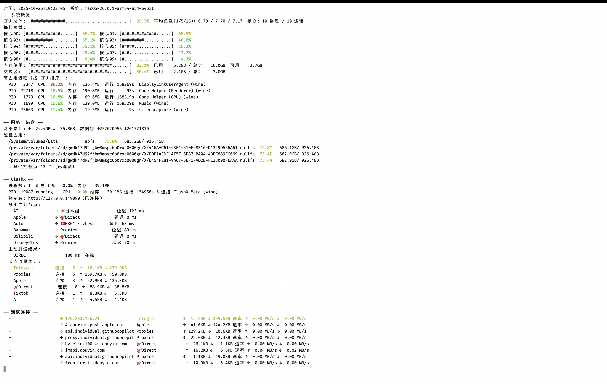

macOS 资源监控脚本 — 极致详细使用指南
======================================

一、脚本功能速览
-----------------
- 系统概览：展示总 CPU、每核负载、1/5/15 分钟平均负载，以及内存、交换区占用和高负载进程。
- 速率差分：按自定义窗口统计网络、磁盘的上下行速率，并用 ASCII sparkline 展示趋势。
- ClashX 深度集成：
  * 实时读取各策略分组当前节点与历史延迟。
  * 主动对热门节点发起 delay 测速，标记在线状态。
  * 聚合节点流量和会话数，高亮流量最大的节点。
  * 罗列活跃连接（进程 → 目标 → 节点 → 上下行速率）。
- 其他能力：进程过滤、彩色条形图、JSON 输出、快照日志、差分阈值高亮等。

二、依赖与准备
---------------
1. Python 3.8 以上版本（默认使用 `/usr/bin/python3`）。
2. 安装 psutil：`pip install psutil`。
3. ClashX 中打开 external-controller（默认 `http://127.0.0.1:9090`），如设有 secret 需记住密钥。

三、快速启动命令
-----------------

  /usr/bin/python3 Notes/python3/mac_system_monitor.py \\
    --interval 5 \\
    --diff-interval 2 \\
    --clash-controller http://127.0.0.1:9090 \\
    --clash-node-limit 6 \\
    --clash-test-url http://www.gstatic.com/generate_204 \\
    --clash-test-timeout 5000 \\
    --clash-connection-limit 8

  注意：续行符 `\` 后必须紧跟换行且不得包含空格。若不便，可改为单行：

  /usr/bin/python3 Notes/python3/mac_system_monitor.py --interval 5 --diff-interval 2 --clash-controller http://127.0.0.1:9090 --clash-node-limit 6 --clash-test-url http://www.gstatic.com/generate_204 --clash-test-timeout 5000 --clash-connection-limit 8

四、核心参数详解
-----------------
- `--interval <秒>`             刷新间隔，默认 5。
- `--diff-interval <秒>`        速率差分窗口；设为 0 可关闭趋势图。
- `--sparkline-length <数>`     趋势条样本长度（默认 20）。
- `--metrics cpu,mem,...`       自定义输出模块，如 `cpu,network,proxy`。
- `--once`                      只输出一次快照。
- `--no-color`                  关闭彩色输出（适合日志环境）。
- `--json` / `--log-file`       启用 JSON 输出或追加日志。
- `--clash-controller URL`      ClashX 控制端地址，默认 `http://127.0.0.1:9090`。
- `--clash-secret KEY`          控制端访问密钥（如配置了 secret）。
- `--clash-node-limit N`        展示的节点数量上限，默认 6。
- `--clash-test-url URL`        主动测速目标 URL（默认 gstatic）。
- `--clash-test-timeout MS`     单次 delay 测速超时，单位毫秒。
- `--clash-connection-limit N`  活跃连接列表长度，默认 8。
- `--process-filter/-p KEY`     进程过滤关键字；可多次指定或用逗号分隔。

五、输出结构说明
-----------------
1. **系统概览**：总览指标、每核条形图、前五高负载进程。
2. **网络与磁盘**：
   - 网络速率达 5 MB/s 或 20 MB/s 会使用黄色/红色高亮。
   - 磁盘仅显示占用率最高的前 4 个挂载点，其余汇总为“已隐藏”。
3. **ClashX 模块**：
   - 展示 ClashX 进程统计、策略分组当前节点与延迟。
   - 主动测速列表会注明节点在线/离线和延迟值。
   - 节点流量统计会对流量最高者加亮显示。
4. **活跃连接**：
   - 记录当前连接的进程、目标、节点、累计流量、上下行速率。
   - 第一条高亮，便于快速锁定带宽大户。
5. **趋势行**：
   - 形式 `趋势: ↑: [._:-]  ↓: [.=-*]`，越靠右表示速率越高。

六、典型使用场景
-----------------
- 快速健康检查：`--once --metrics cpu,network,proxy`。
- 日志记录：配合 `--json` 或 `--log-file monitor.log` 定时运行。
- Clash 调优：
  * 主动测速可辅助挑选节点。
  * 流量统计定位异常高流量节点。
  * 活跃连接帮助追踪对应进程。
- 无 Clash 场景：直接忽略 `proxy` 模块或通过 `--metrics` 排除。

七、常见问题与排障
-------------------
- `psutil` 缺失：按提示执行 `pip install psutil`。
- Clash 控制端连接报错：检查 external-controller 是否启用、端口/secret 是否匹配。
- sparkline 显示异常：确保终端使用 UTF-8，必要时 `export LC_ALL=en_US.UTF-8`。
- 命令复制失败：确认续行符 `\` 后无空格，或改用单行命令。

更多参数与高级用法，请执行 `--help` 查看官方描述。
